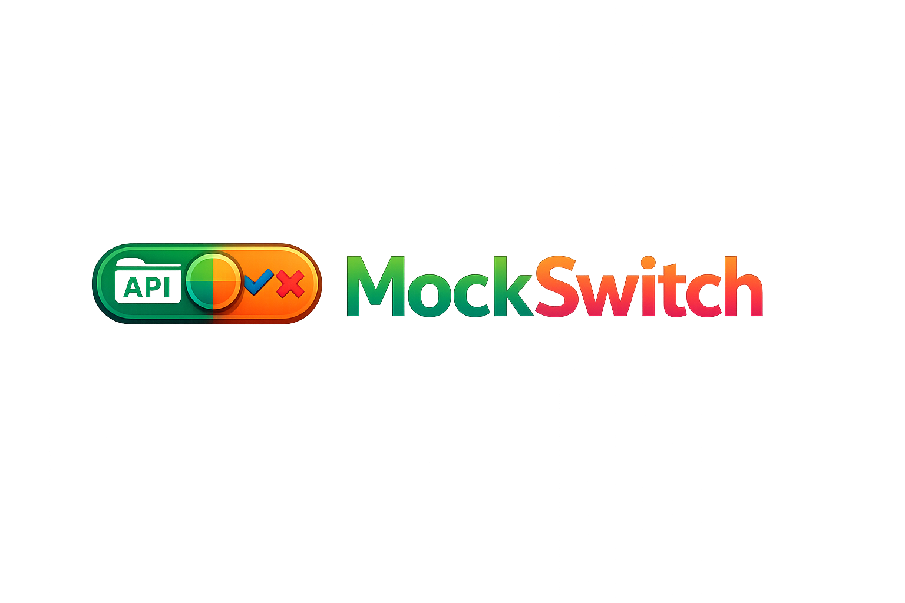
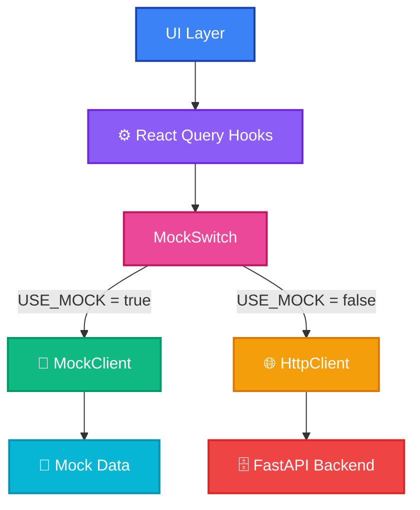

<h1 align="center">
  
  <br/>
  <b>Mock Switch</b>
</h1>

<h3 align="center">
  
</h3>

## About

MockSwitch is a proof of concept that implements a logical data source abstraction layer. It enables seamless switching between mock data (for staging environments and client approval) and production API calls, allowing teams to demonstrate features in static environments like Vercel while maintaining real backend integration in production.

**Key Features:**

- Dynamic switching between mock and production data sources
- Seamless React Query integration with no component changes required
- Ideal for client presentations in static hosting environments
- Full production API compatibility when needed

## How It Works



### Architecture Overview

MockSwitch implements a **Broker Pattern** architectural design, creating a flexible abstraction layer that decouples data consumers from data providers. This pattern enables runtime switching between data sources without requiring changes to application logic.

**Design Pattern: Broker Architecture**

The system operates as a message broker that intercepts all data requests and routes them to the appropriate backend implementation:

**Core Components:**

1. **UI Layer** - React components that consume data through the hook interface. Components maintain complete agnosticism regarding the underlying data source, enabling seamless environment switching.

2. **React Query Hooks** - Typed contract layer that defines the data access interface. Custom hooks (e.g., `useAgenda()`, `useUsuarios()`) implement caching, state management, and synchronization logic while delegating actual API calls to the broker.

3. **MockSwitch Broker** - Central routing mechanism controlled via `USE_MOCK` configuration. The broker implements the Strategy pattern to dynamically select the appropriate client implementation at runtime without requiring code changes or recompilation.

4. **MockClient** - Implementation of the client interface that returns hardcoded, semantically valid test data. Eliminates external dependencies during development/staging and enables Vercel static deployments for client demonstrations.

5. **HttpClient** - Production-grade implementation that communicates with the FastAPI backend via HTTP/REST protocols. Handles authentication, error management, and real-time data synchronization.

6. **Mock Data Layer** - TypeScript-based data fixtures structured identically to backend API responses, ensuring structural consistency between environments and facilitating seamless environment switching.

7. **FastAPI Backend** - Production API service providing database integration, business logic execution, authentication/authorization, and multi-tenant data isolation.

**Implementation Details:**

The broker pattern is implemented through a centralized configuration export (`api/index.ts`):

```typescript
// Pseudo-code representation
const USE_MOCK = process.env.USE_MOCK === "true";

export const agendaClient = USE_MOCK
  ? new MockAgendaClient() // Returns hardcoded test data
  : new HttpAgendaClient(); // Executes real API calls
```

Each hook then delegates to the selected client:

```typescript
// Pseudo-code
export const useAgenda = () => {
  return useQuery({
    queryKey: ["agenda"],
    queryFn: () => agendaClient.getAgenda(), // Calls appropriate implementation
  });
};
```

**Advantages of This Approach:**

- **Environment Agnosticism**: Components require zero modification when switching between mock and production environments
- **Type Safety**: TypeScript interfaces ensure structural consistency across implementations
- **Development Efficiency**: Frontend teams can develop independently without backend availability
- **Client Demonstrations**: Static deployments on Vercel enable client approval cycles without infrastructure overhead
- **Testing Flexibility**: Both mock and real backends can be tested simultaneously
- **Deployment Consistency**: Identical codebase deploys to staging (mock) and production (real API)

**Configuration & Deployment:**

- **Development/Staging (Vercel)**: `USE_MOCK=true` → Static site with mock data
- **Production**: `USE_MOCK=false` → Dynamic site with real API integration
